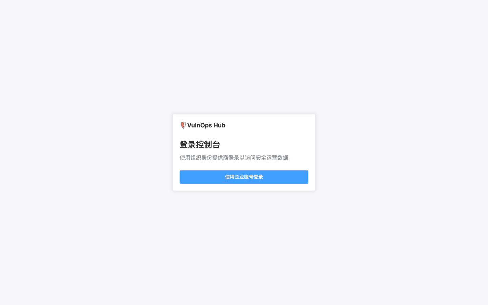
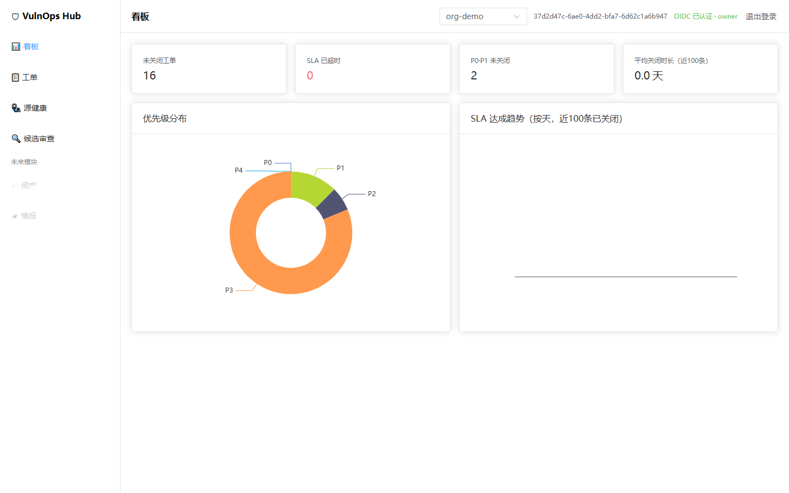
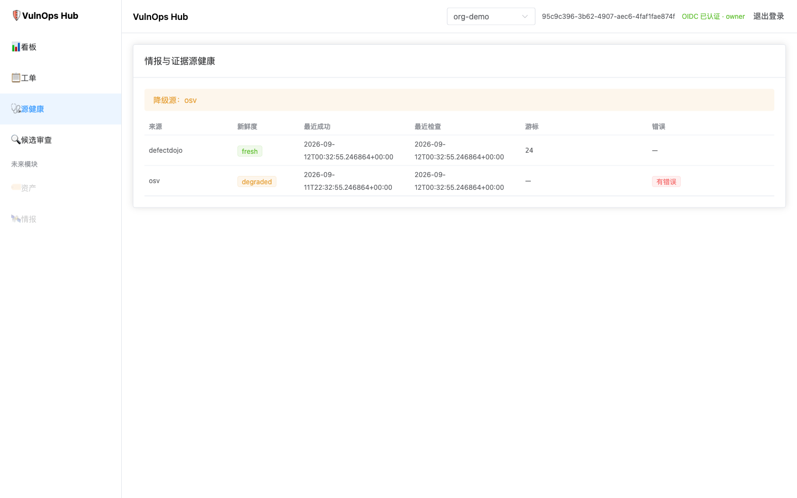
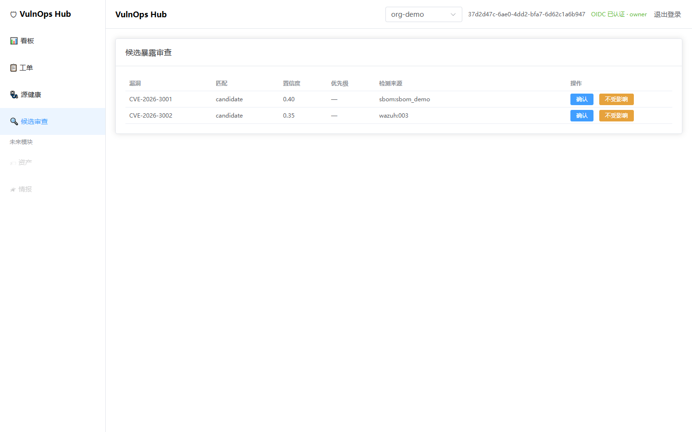
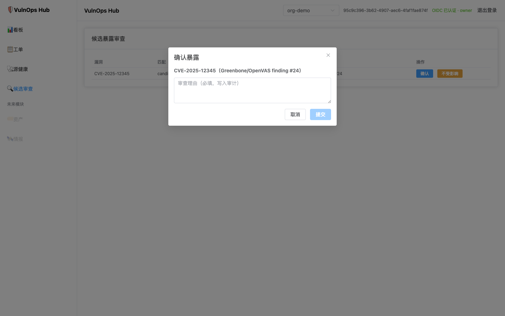
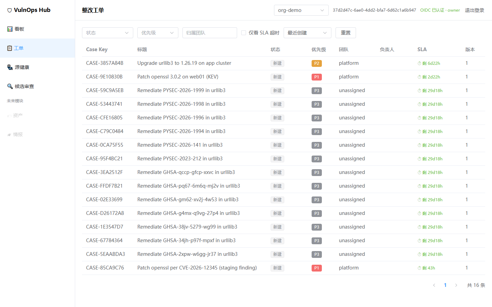
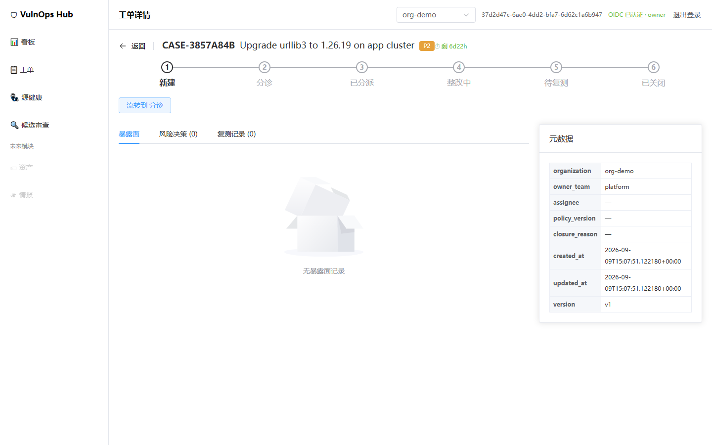
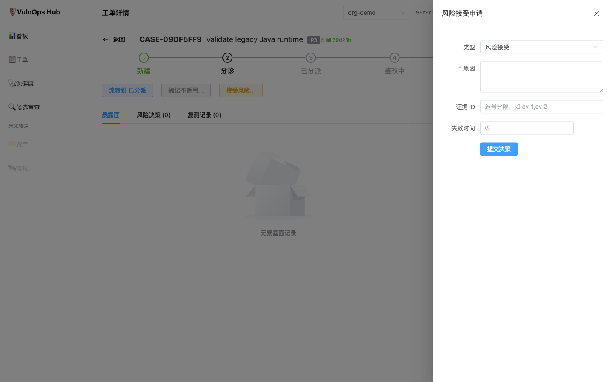
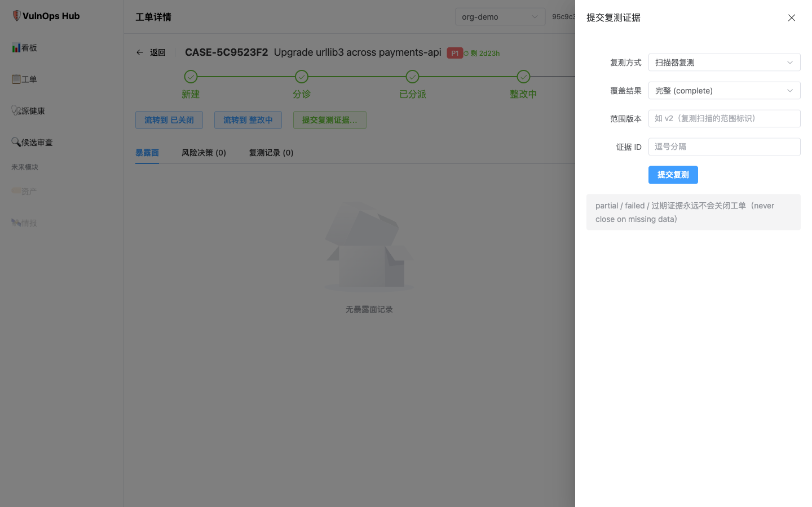
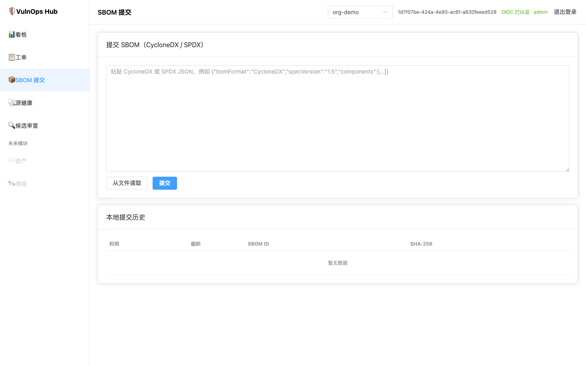

# VulnOps Hub

> **Status: M1 technical preview.** The core FastAPI vertical slice and Vue 3
> operations console are implemented and locally verified. OIDC bearer
> authentication and organization-scoped RBAC are enforced and covered by the
> automated verification suite. The broader MVP exit gate in the
> [roadmap](docs/mvp-roadmap.md) is not complete: first-adopter integration
> evidence and several operational capabilities are still pending. Configure a
> real OIDC provider before exposing the service beyond a trusted test network.

VulnOps Hub is an open-source vulnerability-operations control plane. It
correlates public vulnerability intelligence, asset and software inventories,
SBOMs, and scanner evidence into explainable **exposures** and auditable
**remediation cases**.

中文简介：VulnOps Hub 不是另一个扫描器，也不复制一份 CVE 数据库。它把
公开漏洞情报、本地资产和 SBOM、各类漏扫结果，以及整改工单串成一个可追溯的
生命周期闭环：发现 → 匹配 → 分派 → SLA → 风险接受 → 整改 → 复测 → 关闭或重开。
M1 技术预览版已可运行：后端为 FastAPI 服务（含 Swagger UI），另有后台
ingestion worker，并附带 Vue 3 整改运营控制台（frontend/），单容器随 API
一同部署。OIDC 身份认证和组织级 RBAC 已由服务端强制执行并纳入自动化验证；
首个采用方的集成验收和部分运营能力仍未完成，因此还未达到 roadmap 定义的完整
MVP 退出条件。运行方式见下文 Quick start。

## Console screenshots

Captured from the Vue 3 operations console against a local staging dataset
(see `docs/operations/integrated-staging.md`). Login uses the sandbox Keycloak
realm; the screens then follow the operational path from source health and
candidate review to a case, a time-bounded risk decision, and verification.
The actions shown in drawers are intentionally unsubmitted screenshots, so
they document the required evidence without changing a remediation state.

| | |
| --- | --- |
|  |  |
| *1. Login — OIDC redirects to the organization identity provider* | *2. Dashboard — open work, SLA and priority distribution* |
|  |  |
| *3. Source health — cursor, freshness and upstream degradation signals* | *4. Candidate queue — lower-confidence matches wait for a human decision* |
|  |  |
| *5. Candidate decision — a required reason becomes part of the audit trail* | *6. Case list — priority, owner, SLA and current lifecycle state* |
|  |  |
| *7. Case detail — lifecycle stepper, evidence tabs and metadata* | *8. Risk acceptance — evidence and expiry are mandatory* |
|  |  |
| *9. Verification — partial, failed or stale evidence cannot close a case* | *10. SBOM submit — CycloneDX/SPDX ingestion entry point* |

## Quick start

Requirements: Python 3.11+, [uv](https://docs.astral.sh/uv/), Node.js 24.21.0,
and pnpm 9. The Node baseline is recorded in `.nvmrc` and `.node-version`, and pnpm
rejects unsupported Node versions during install. The API can use a SQLite file
(`vulnops.db`) for local evaluation, but an OIDC issuer and audience are required
for every non-test server. Configure them in `.env` before starting the API. A
web console is available: run `make frontend-install` once, then
`make frontend-dev` in a second terminal and open `http://localhost:5173` (the
Vite dev server proxies `/api` to `:8000`).

~~~bash
# 1. Install dependencies and configure OIDC_ISSUER_URL/OIDC_AUDIENCE in .env
cp .env.example .env
make install                # uv sync --extra dev

# 2. Apply database migrations (creates ./vulnops.db)
make migrate                # uv run alembic upgrade head

# 3. Start the API
make dev                    # uvicorn vulnops.main:app --port 8000 --reload
~~~

Once it is running:

| URL | Purpose |
| --- | --- |
| `http://localhost:8000/docs` | Swagger UI — interactive API console |
| `http://localhost:8000/health/live` | Liveness probe |
| `http://localhost:8000/health/ready` | Readiness probe (checks database) |

Drive it end to end:

~~~bash
# Supply an access token whose claims include org-demo and the capabilities
# required below (for example, an appropriately scoped admin token).
export ACCESS_TOKEN='<OIDC access token>'
AUTH=(-H "Authorization: Bearer ${ACCESS_TOKEN}")

# Create a remediation case (SLA clock starts; P1 due in 3 days)
curl -s -X POST http://localhost:8000/api/v1/organizations/org-demo/cases \
  "${AUTH[@]}" \
  -H "Content-Type: application/json" \
  -d '{"title": "Patch openssl on demo host", "owner_team": "platform", "priority": "P1"}'

# Submit a CycloneDX SBOM
curl -s -X POST http://localhost:8000/api/v1/organizations/org-demo/sboms \
  "${AUTH[@]}" \
  -H "Content-Type: application/json" -H "Idempotency-Key: demo-001" \
  -d '{"bomFormat": "CycloneDX", "specVersion": "1.5", "components": []}'

# Move the case through its state machine (If-Match enforces optimistic locking)
curl -s -X POST http://localhost:8000/api/v1/organizations/org-demo/cases/<case_id>/transitions \
  "${AUTH[@]}" \
  -H "Content-Type: application/json" -H 'If-Match: "1"' \
  -d '{"target": "triage"}'
~~~

Reset the local database with `make clean`.

### Run the full stack with Docker

~~~bash
cp .env.example .env        # adjust defaults if needed
# Set OIDC_ISSUER_URL and OIDC_AUDIENCE in .env. Configure the frontend build
# through frontend/.env (copy frontend/.env.example first).
cp frontend/.env.example frontend/.env
docker compose up --build
~~~

This starts the authenticated API (`:8000`), the ingestion worker, PostgreSQL,
Valkey, and MinIO (`:9001` console). `make health` smoke-tests the probes.

The API image also serves the web console — after `make frontend-build`, the
built SPA is baked in and available at `http://localhost:8000`.

### Tests

~~~bash
make test                   # unit + integration + contract + e2e
make lint                   # ruff
make frontend-test          # Vue unit tests (Node 24 + pnpm 9)
make frontend-build         # build the production SPA
~~~

### Local and CI OIDC verification

The checked-in Playwright configuration starts the loopback-only test issuer in
`tests/e2e/oidc_test_issuer.py`, starts the API with real OIDC verification, and
uses fixed owner, auditor, expired-token, and cross-organization identities.
It is test infrastructure only and must not be exposed or configured as a
production identity provider. To run the same browser suite locally, build the
SPA with the test issuer settings before invoking Playwright:

~~~bash
export E2E_OIDC_ISSUER=http://127.0.0.1:9000
export E2E_OIDC_AUDIENCE=vulnops-api
cd frontend
VITE_OIDC_AUTHORITY="$E2E_OIDC_ISSUER" \
VITE_OIDC_CLIENT_ID=vulnops-e2e \
VITE_OIDC_REDIRECT_URI=http://127.0.0.1:4173/auth/callback \
VITE_OIDC_POST_LOGOUT_REDIRECT_URI=http://127.0.0.1:4173/login \
VITE_OIDC_SCOPE='openid profile email' \
pnpm build
pnpm exec playwright test
~~~

CI uses these same issuer settings and builds the SPA with them. The browser
flows cover login, auditor read-only rendering, an owner transition, expired
tokens, and cross-organization 404 denial; they do not represent production
IdP integration evidence.

## Using VulnOps Hub: console + API

VulnOps Hub ships a built-in web console (整改运营控制台) for the daily
remediation workflow, plus a full REST API. Four ways to drive it:

1. **Web console** — served by the same process at `/` (dashboard, case
   lifecycle, SBOM submission). Run `make frontend-build` once so
   `frontend/dist` exists; without it the API falls back to JSON responses.
2. **Swagger UI** — open `http://localhost:8000/docs` and use *Try it out* on
   any endpoint. Zero setup; the interactive way to explore.
3. **Any HTTP client** — every operation is plain REST. The machine-readable
   spec is served at `/openapi.json` and checked in at `openapi/openapi.yaml`,
   so you can generate clients for any language.
4. **Automation** — CI pipelines POST SBOMs; the worker consumes DefectDojo
   findings and Wazuh inventory events from the queue.

### A complete workflow

Every endpoint is under `/api/v1` and scoped by organization. The case state
machine (transitions are enforced server-side and audited):

~~~mermaid
stateDiagram-v2
  [*] --> new
  new --> triage
  triage --> assigned
  triage --> risk_accepted
  triage --> not_applicable
  assigned --> in_progress
  in_progress --> awaiting_verification
  awaiting_verification --> closed
  awaiting_verification --> in_progress
  closed --> reopened
  reopened --> triage
~~~

Step by step, tested with curl against a fresh database:

~~~bash
ORG=http://localhost:8000/api/v1/organizations/org-demo
export ACCESS_TOKEN='<OIDC access token with the required capability>'
AUTH=(-H "Authorization: Bearer ${ACCESS_TOKEN}")

# 1. Submit a CycloneDX SBOM (idempotent via Idempotency-Key)
curl -s -X POST $ORG/sboms "${AUTH[@]}" -H "Content-Type: application/json" \
  -H "Idempotency-Key: demo-001" \
  -d '{"bomFormat":"CycloneDX","specVersion":"1.5","components":[{"type":"library","name":"openssl","version":"3.0.2"}]}'

# 2. Create a case — priority starts the SLA clock (P0=1d P1=3d P2=7d P3=30d P4=90d)
curl -s -X POST $ORG/cases "${AUTH[@]}" -H "Content-Type: application/json" \
  -d '{"title":"Patch openssl on demo host","owner_team":"platform","priority":"P1"}'
# -> {"id":"case_...","status":"new","due_at":"<created + 3 days>","etag":"\"1\""}

# 3. Walk the lifecycle. Ask what is legal, then transition with If-Match
#    (optimistic locking on the case version).
curl -s $ORG/cases/<case_id>/allowed-transitions "${AUTH[@]}"
curl -s -X POST $ORG/cases/<case_id>/transitions -H 'If-Match: "1"' \
  "${AUTH[@]}" -H "Content-Type: application/json" -d '{"target":"triage"}'
# repeat with the new etag: triage -> assigned -> in_progress -> awaiting_verification

# 4. Or accept the risk instead of patching. An *approved* decision requires a
#    distinct approver holding an approver role (risk_approver / security_lead /
#    policy_admin), evidence ids, and a reason — otherwise it stays pending.
curl -s -X POST $ORG/cases/<case_id>/risk-decisions -H "Content-Type: application/json" \
  "${AUTH[@]}" \
  -d '{"type":"risk_accepted","reason":"compensating WAF rule","evidence_ids":["ev-1"],
       "expires_at":"2026-12-31T00:00:00Z"}'
# Approval is a separate request made with a distinct approver token:
# curl -s -X POST $ORG/cases/<case_id>/risk-decisions/<decision_id>/approval \
#   -H "Authorization: Bearer ${APPROVER_TOKEN}" -H "Content-Type: application/json" \
#   -d '{"outcome":"approved","reason":"reviewed compensating control"}'

# 5. Prove remediation. status=complete coverage with a valid method closes the
#    case; failed/partial/stale evidence never does ("never close on missing data").
curl -s -X POST $ORG/cases/<case_id>/verifications -H "Content-Type: application/json" \
  "${AUTH[@]}" \
  -d '{"method":"scanner","coverage":{"status":"complete","scope_version":"v2"}}'
~~~

DefectDojo and Wazuh evidence is ingested asynchronously by the worker
(`python -m vulnops.workers.ingestion`), which consumes jobs from the
Redis/Valkey queue — in the Docker stack it runs as its own service; with a
bare `make dev` and no Redis it simply idles. Every transition, risk decision,
and verification also writes an audit event and an outbox record inside the
transaction.

## Deployment

Three supported modes (full design: [docs/deployment.md](docs/deployment.md)):

| Mode | Intended use | Stack |
| --- | --- | --- |
| Local evaluation | development, demo | `make dev` — API on SQLite with a configured OIDC issuer |
| Docker Compose | single-host evaluation, small teams | API + worker + PostgreSQL + Valkey + MinIO |
| Production target (not yet certified) | internal enterprise service | Containers on Kubernetes, managed PostgreSQL / object store / queue, OIDC, OpenTelemetry |

Configuration is environment-driven — copy `.env.example` to `.env` and adjust.
Key variables (full list in `.env.example`, parsed in `src/vulnops/config.py`):

| Variable | Default | Purpose |
| --- | --- | --- |
| `DATABASE_URL` | `sqlite:///./vulnops.db` | SQLAlchemy DSN — use `postgresql+psycopg2://...` for anything shared |
| `REDIS_URL` | – | Ingestion queue; the worker idles when unset |
| `OBJECT_STORAGE_ENDPOINT` / `_BUCKET` / `_ACCESS_KEY` / `_SECRET_KEY` | – | S3/MinIO for raw source snapshots |
| `PUBLIC_URL`, `ENVIRONMENT`, `LOG_LEVEL` | `http://localhost:8000`, `development`, `INFO` | Core posture |
| `OIDC_ISSUER_URL` / `OIDC_AUDIENCE` | required | OIDC discovery/JWKS issuer and access-token audience; all business `/api/v1` routes require a valid bearer token (health probes remain public) |
| `OIDC_ALLOW_INSECURE_LOOPBACK` | `false` | Explicit local-staging-only opt-in for a host-run API and an IP-loopback HTTP issuer; never use for a containerized or production API |
| `DEFECTDOJO_BASE_URL` / `WAZUH_BASE_URL` / `VULNERABILITY_LOOKUP_BASE_URL` | – | Adapter endpoints; disabled while unset |

Production hardening requirements (identity, secrets, network isolation,
observability, backups) are specified in
[docs/deployment.md](docs/deployment.md) §3 and §8.

## Why this project

Most mature open-source tools excel at one part of the problem:

| Capability | Preferred reusable capability | Role in this design |
| --- | --- | --- |
| Scanner report parsing, deduplication, test history | [DefectDojo](https://github.com/DefectDojo/django-DefectDojo) | Ingest and preserve raw scanner findings |
| Multi-source vulnerability intelligence | [Vulnerability-Lookup](https://github.com/vulnerability-lookup/vulnerability-lookup) | Enrich and correlate CVE, KEV, EPSS, VEX, vendor advisories |
| Endpoint inventory and package evidence | [Wazuh](https://documentation.wazuh.com/current/user-manual/capabilities/system-inventory/) | Supply observed host/software state |
| Network vulnerability scanning | [Greenbone Community Edition / OpenVAS](https://greenbone.github.io/docs/latest/) | Supply authenticated and network scan evidence |

The missing layer is reliable correlation:

~~~text
public advisory + component/version + asset context + local evidence
                         ↓
                 explainable exposure
                         ↓
       owner + risk policy + SLA + verification evidence
                         ↓
             auditable remediation lifecycle
~~~

VulnOps Hub is deliberately that layer. It integrates with, rather than forks or
reimplements, the systems above.

## Design principles

1. **Reuse first.** Do not build a new scanner parser library, CVE mirror, or
   endpoint agent when a maintained open-source system already does it well.
2. **Evidence before automation.** A global CVE is not a ticket. A ticket is
   created only after an asset/component match has evidence and a recorded
   confidence.
3. **Stable identities over fuzzy names.** Prefer asset IDs, purls, supplier
   package identifiers, and version ranges. CPE/name heuristics remain
   reviewable candidates, not silent auto-closures.
4. **Lifecycle is a case, not a scanner row.** One remediation case may group
   multiple exposures while retaining each asset-level fact and its provenance.
5. **Never close on missing data.** A failed, partial, or out-of-scope rescan
   cannot prove remediation.
6. **Explain every priority.** Risk score, policy version, source freshness,
   match method, exception decision, and state transition are all auditable.
7. **Keep license boundaries explicit.** External integrations are connected
   through documented APIs and deployment boundaries; no upstream code is copied
   into this project.

## Proposed scope

### In scope

- Scheduled intelligence enrichment from CVE/NVD, CISA KEV, FIRST EPSS, OSV,
  CSAF/VEX, and vendor advisory sources, preferably through
  Vulnerability-Lookup where appropriate.
- Canonical asset, service, component, and SBOM identity.
- Ingestion of scanner/endpoint evidence through DefectDojo, Wazuh, Greenbone,
  and open adapter contracts.
- Deterministic and reviewable vulnerability matching.
- Risk policy evaluation, case grouping, ownership, SLA clocks, approvals,
  risk acceptance, verification, closure, and reopening.
- Immutable audit events and external ticket/notification projections.

### Explicitly out of scope for the MVP

- Writing a new network scanner, endpoint agent, SAST/SCA engine, or universal
  report parser.
- Mirroring every public vulnerability record into a new authoritative CVE
  database.
- Autonomous patch deployment or unreviewed AI remediation advice.
- Multi-tenant SaaS billing and cross-organization data sharing.

## Documentation

- [Development guide](docs/development.md) — supported toolchain, repository
  layout, local workflow, migrations, OpenAPI generation, and verification.
- [MVP acceptance matrix](docs/acceptance-matrix.md) — implemented, partial,
  and open criteria with exact test evidence.
- [Architecture](docs/architecture.md) — boundaries, data flow, ownership, and
  failure behavior.
- [Data model](docs/data-model.md) — canonical entities, identities,
  relationships, retention, and state machines.
- [Module design](docs/modules.md) — module responsibilities and adapter
  contracts.
- [API design](docs/api.md) — REST and event interfaces, idempotency, and
  authorization.
- [Deployment design](docs/deployment.md) — local, production, operations, and
  security requirements.
- [MVP and roadmap](docs/mvp-roadmap.md) — scope gates, acceptance criteria,
  and sequenced milestones.
- [OIDC and RBAC design](docs/security/oidc-rbac-design.md) — next M1 security
  slice, trust boundaries, roles, and failure behavior.
- [Research and architecture decisions](docs/research.md) — evidence behind the
  reuse-first approach and licensing boundaries.
- [Implementation plan](docs/plans/2026-09-05-vulnops-hub-mvp.md) — a
  historical test-first build plan with current completion markers.
- [Changelog](CHANGELOG.md) — technical-preview changes and known limitations.

## Architecture in one view

~~~mermaid
flowchart LR
  subgraph Sources
    Intel["CVE / NVD / CISA KEV / EPSS / OSV / CSAF"]
    Scan["DefectDojo / Greenbone / other scanners"]
    Inv["Wazuh / CMDB / cloud inventory"]
    SBOM["CycloneDX / SPDX / VEX"]
  end

  Intel --> VL["Vulnerability-Lookup and source adapters"]
  Scan --> Evidence["Evidence adapters"]
  Inv --> Inventory["Asset and inventory adapters"]
  SBOM --> Inventory

  VL --> Match["VulnOps Hub matching and risk policy"]
  Evidence --> Match
  Inventory --> Match

  Match --> Exposure["Exposure graph"]
  Exposure --> Case["Remediation cases, SLA, exceptions"]
  Case --> Verify["Verification and reopen rules"]
  Case --> Work["Jira / ServiceNow / notifications"]
  Verify --> Case
~~~

## What makes an exposure actionable?

An **exposure** is the time-bounded assertion that a particular asset contains
or exposes a vulnerable component. It carries evidence, not just a CVE ID:

- an observed component and version from an SBOM, Wazuh, authenticated scan, or
  trusted scanner report;
- an affected version range or scanner-confirmed detection;
- the asset/service identity, criticality, reachability, and owner;
- source provenance, match method, confidence, and last evaluation time.

The platform can automatically create a remediation case for high-confidence
matches according to policy. Candidate matches stay in a triage queue. A case
can close only with positive verification evidence; it reopens on new
confirming evidence, a failed retest, an expired exception, or a revised
affected-range evaluation.

## Repository status and contribution

The implemented M1 technical preview is a modular monolith (FastAPI + SQLAlchemy + Alembic):
SBOM ingestion (CycloneDX/SPDX) with content hashing and idempotency, the
remediation-case lifecycle with SLA clocks, state-machine transitions, and
optimistic locking (`If-Match`), evidence-adapter contracts for DefectDojo and
Wazuh, and an ingestion worker. The web console (`frontend/`, Vue 3 + Element
Plus) covers the remediation workflow: dashboard, case list/detail with
state-machine actions, risk decisions, verification, and SBOM submission. See
the [MVP roadmap](docs/mvp-roadmap.md) before proposing new scanners, feeds, or
UI features. It is not yet the roadmap's complete MVP: authentication and
authorization enforcement, first-adopter integration evidence, source and
coverage operations, and external ticket/notification projections remain open.

Please read [CONTRIBUTING.md](CONTRIBUTING.md) and [SECURITY.md](SECURITY.md)
before opening an issue or pull request.

## License

The documentation and project code are licensed under
[Apache-2.0](LICENSE). Names and marks of integrated projects belong to their
respective owners; this project is not affiliated with or endorsed by them.
